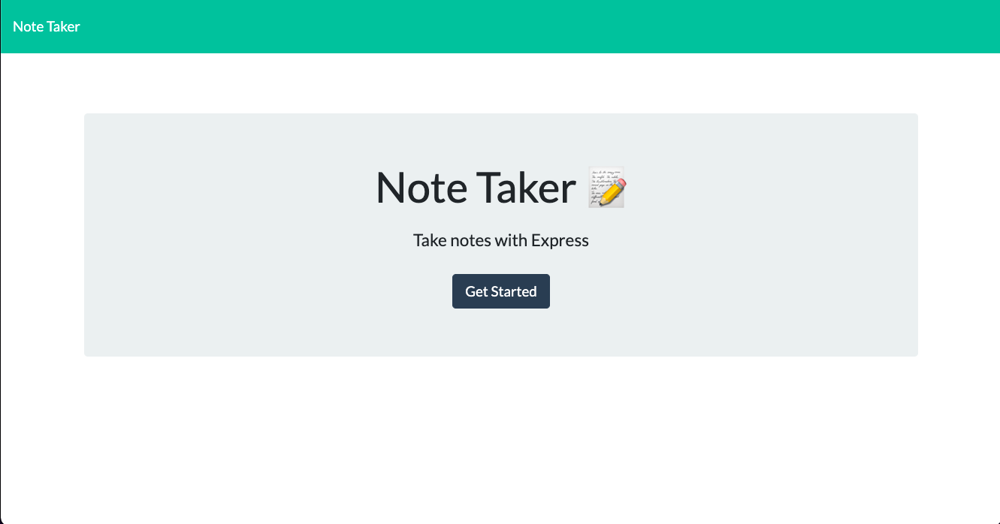
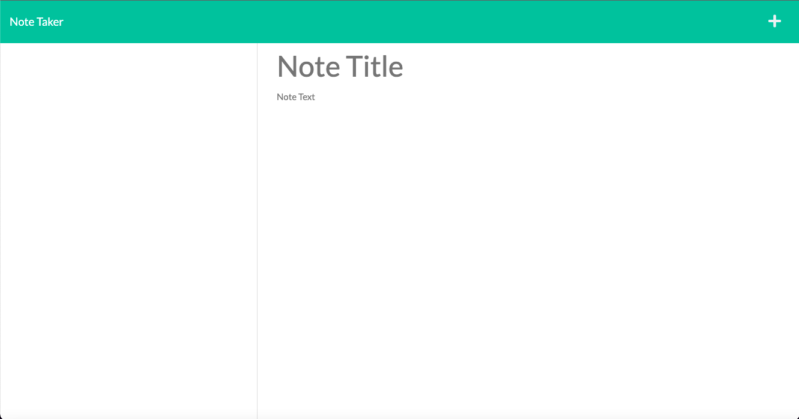

# Note Taker 

## Description
Write down and save all your personal notes!

## User Story
- WHEN I click the 'Get Started' button
- THEN I am taken to the notes page
- WHEN I click on the title or text
- THEN I am able to input my note
- WHEN I click the save button
- THEN my input is saved as a new note

## Technologies Used
- HTML
- CSS
- Javascipt
- Node

## License
The MIT License is a permissive free software license originating at the Massachusetts Institute of Technology (MIT) in the late 1980s. As a permissive license, it puts only very limited restriction on reuse and has, therefore, high license compatibility.

## Deployed Site
[Link](https://github.com/MBrunoStem/note-taker)

## Landing Page

## Contributors
Mario Bruno
* [GitHub](https://github.com/MBrunoStem)
* mbrunostem@gmail.com